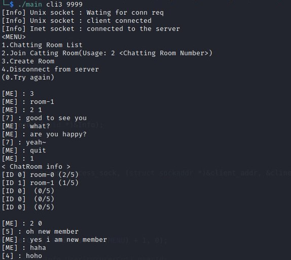

# Multi-Chat_Program
### 다중 사용자 접속 채팅 프로그램
#### Team Member : 박건형
#### Project Period : 2021/05/18 ~ 2021/05/31
----

## 프로젝트 개요
C언어, 소켓, 쓰레드 를 사용하여 다중 사용자가 사용할 수 있는 채팅 서버와 사용자 채팅 프로그램을 제작했습니다.

**구성 프로그램**
- 채팅 서버
- 사용자 채팅 입력 프로그램 
- 사용자 디스플레이 프로그램

## 다이어그램
>User Input와 User Display 는 Local에서 실행 되고, Main Server는 원격지에 있다고 가정 합니다.<br>

<br>
사용자는 채팅방 만들기, 채팅방 리스트를 조회를 할 수 있고 
채팅방에 참가하여 같은 채팅방에 접속한 사용자와 채팅이 가능합니다.

**_기능별 다이어그램_**

<details>
<summary>채팅방 리스트 조회</summary>

<br>
</details>

<details>
<summary>채팅방 생성</summary>

<br>
</details>

<details>
<summary>채팅방 참가</summary>

<br>
</details>


## 프로젝트 실행

```bash
# 서버실행 (<PORT> : 포트번호 입력)
$ ./Multi-Chat_Program/Server/MainServer <PORT>

# 사용자(클라이언트) 실행 (<USER_NAME> : AF_UNIX 소켓 이름, <SERVER_PORT> : 위에서 입력한 서버 포트)  
$ ./Multi-Chat_Program/Client/main <USER_NAME> <SERVER_PORT> # 사용자 디스플레이
$ ./Multi-Chan_Program/Client/input <USER_NAME> # 사용자 입력
```

__ex)__
```bash
$ ./Multi-Chat_Program/Server/MainServer 9999

$ ./Multi-Chat_Program/Client/main User1 9999
$ ./Multi-Chan_Program/Client/input User1
```

## 프로젝트 실행 화면

<details>
<summary>서버 화면</summary>

<br>
</details>

<details>
<summary>사용자 1번 화면</summary>

_Display_<br>
<br>
_Input_<br>
<br>
</details>

<details>
<summary>사용자 2번 화면</summary>

_Display_<br>
<br>
_Input_<br>
<br>
</details>

<details>
<summary>사용자 3번 화면</summary>

_Display_<br>
<br>
_Input_<br>
<br>
</details>

<details>
<summary>사용자 4번 화면</summary>

_Display_<br>
<br>
_Input_<br>
<br>
</details>